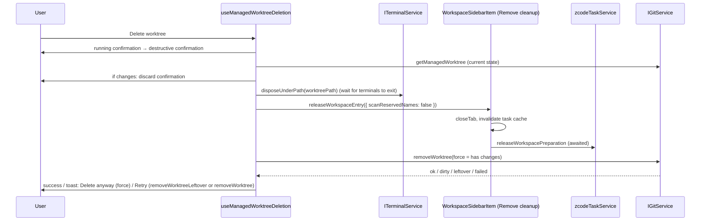
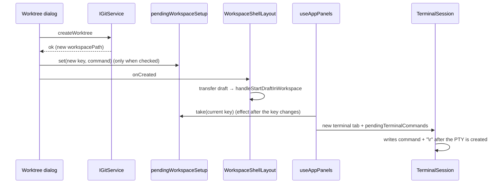

# Start a task in a new Git worktree

> Chinese version: [git-worktree-task.md](git-worktree-task.md). The Chinese file is normative; keep both in sync.

## Background

Codex desktop can run a task in its own worktree, so it doesn't disturb the current checkout. ZCode
only has "create branch and switch", which switches the current checkout, and no way to create a
worktree; the agent can only call `git worktree` itself through bash. This spec reuses the existing
branch dialog, workspace opening and draft transfer, and adds one Git service method.

## Interface and state owners

- Git itself is the source of truth for worktrees; ZCode keeps no separate worktree list.
- `IGitService.createWorktree({ workspacePath, branchName }): Promise<GitCreateWorktreeResult>`,
  implemented by `createGitService` → `GitCliRepo.createWorktree` (code in
  `git/repo/gitWorktree.ts`):
  - Success: `{ ok: true, branchName, worktreePath, workspacePath }`. Failure:
    `{ ok: false, branchName, issues }`, where `issues` reuses `GitBranchMutationIssue` (invalid branch
    name, branch already exists, unknown).
- The new workspace is just a new path: its identity key stays
  `workspaceIdentity?.trim() || workspacePath`, with no new protocol field.

## Service rules

1. An unavailable repository is an error. An invalid or existing branch name returns the matching
   issue and creates no worktree. The worktree starts from HEAD and does not touch the current
   checkout, so conflicts or a merge/rebase in progress there do not block it.
2. Worktree root: `<ZCode data dir>/worktrees/<repo folder name>-<first 8 hex of sha256(repo root)>/<branch slug>`.
   The slug replaces characters outside `[A-Za-z0-9._-]` with `-`, and a Windows reserved
   device name (`con`, `prn`, `aux`, `nul`, `com1`–`com9` or `lpt1`–`lpt9` before the first `.`, any case)
   gets a `wt-` prefix on every platform. If the directory exists, try `-2`,
   `-3`, … (up to 99). It lives outside the repository so it never shows up in the original repo's
   file tree or `git status`.
3. Run `git worktree prune` first (it only drops entries whose directory was deleted; otherwise a
   manually deleted directory of the same name makes the add fail), then
   `git worktree add -b <branch> <path> HEAD`: the new branch starts at the current HEAD.
   **Uncommitted changes are not carried into the new worktree.**
4. If the original workspace is a subdirectory of the repository, the returned `workspacePath` is the
   same subdirectory inside the new worktree. If that subdirectory doesn't exist at HEAD (untracked,
   ignored or new), it falls back to the worktree root.
5. On failure, parse git's output into issues; on success, invalidate the original workspace's cache.

## Interaction

- Only a local workspace's draft composer branch switcher shows "Start in new worktree…" at the
  bottom. Remote workspaces need remote identity construction and are not covered yet.
- It reuses the "create branch" dialog (`mode="worktree"` switches the text), which explains that the
  worktree starts from the current commit without uncommitted changes.
- On success, `requestV4ComposerDraftWorkspaceTransfer` moves the current draft to the new path, then
  `handleStartDraftInWorkspace(newPath, undefined, "project")` opens it as a draft. On failure the
  dialog stays open and a toast shows the first issue. The dialog can't be closed while creation is
  running, and a result that arrives after the host component unmounted is ignored, so it never moves
  the draft or switches workspace late.
- Strings live under `git.worktree.*`, in both `en-US` and `zh-CN`.

## Deleting a worktree

- Only worktrees **created by ZCode** can be deleted: the workspace's checkout is a linked worktree (not
  the main checkout), its root is under `<ZCode data dir>/worktrees/`, **and it carries ZCode's creation
  marker**. Repositories or worktrees the user created themselves (including ones placed in that folder
  by hand) get no delete entry.
  - Creation marker: after `createWorktree` succeeds, `zcode-worktree.json` (`{ createdBy: "zcode",
worktreePath }`) is written to that worktree's own Git admin folder (`git rev-parse
--absolute-git-dir`, i.e. `<common-dir>/worktrees/<name>`). That folder isn't repository content,
    so a clone or checkout can't forge it, and `git worktree remove`/`prune` delete it with the worktree.
    If writing fails, the worktree still works but gets no delete entry. Reading requires the marker to
    exist, `createdBy` to be `zcode`, and the real path of `worktreePath` to match the current checkout.
- `IGitService.getManagedWorktree({ workspacePath })` returns `{ worktreePath, mainWorktreePath,
branchName, hasUncommittedChanges }` when those conditions hold, otherwise `null` (the main checkout
  and branch come from `git worktree list --porcelain`; `hasUncommittedChanges` says whether
  `git status` showed changes, including untracked files, when it was read, and counts as true if that
  read fails).
- `IGitService.removeWorktree({ workspacePath, force? })`:
  - Conditions not met → `{ ok: false, reason: "not-managed" }`.
  - Without `force`, uncommitted changes → `{ ok: false, reason: "dirty" }`, and nothing is deleted.
  - Runs `git worktree remove [--force] <worktreePath>` in the main checkout. On failure it checks the
    registration again: still registered → `{ ok: false, reason: "failed", detail }`; registration gone
    (when deleting the folder fails midway, git may already have removed the admin folder, typically
    because of a Windows folder lock) → `{ ok: false, reason: "leftover", detail }`.
  - Success → `{ ok: true, mainWorktreePath, branchName }`. **The branch and its commits are kept**;
    only the folder and the worktree registration are removed.
- `IGitService.removeWorktreeLeftover({ worktreePath })` cleans up what a `leftover` left behind. It only
  deletes a folder exactly at `<ZCode data dir>/worktrees/<repo folder>/<worktree folder>` that is no
  longer a live Git checkout (no `.git`, or a `.git` file pointing at an admin folder that no longer
  exists); anything else returns `not-leftover`. A folder that no longer exists counts as success.
- `ITerminalService.disposeUnderPath({ path })` ends every terminal whose starting cwd is that folder or
  inside it, and resolves once their processes have exited (with a 5-second cap that only keeps the
  delete flow from hanging). The terminal service owns every PTY, covering the side pane and the bottom
  terminal.
- Interaction: for a local workspace, the sidebar menu shows "Delete worktree" when
  `getManagedWorktree` returns a value (queried when the menu opens).
  1. If the workspace has a running conversation, the existing "Remove" confirmation for running
     workspaces comes first.
  2. A destructive confirmation names the folder that will be deleted and the branch that is kept.
  3. It calls `getManagedWorktree` again for the current state. With uncommitted changes, a second
     confirmation says they will be lost for good, and confirming deletes with `force`. **Every
     confirmation happens before anything is released**, so cancelling at any step has no effect.
  4. It calls `disposeUnderPath(worktreePath)` and **waits for the terminals to exit**, then does the
     same cleanup as "Remove" (close the tab, release the runtime, invalidate the task cache) and
     **waits for the runtime release to finish**. The delete flow skips the Windows reserved-name scan:
     the folder is about to go, and scanning it would hold it open during deletion.
  5. Only then does it call `removeWorktree`. Release comes first because on Windows an Agent or
     terminal process whose cwd is inside the folder locks it, so removing first fails or deletes only
     some of the files.
  6. Outcomes (the sidebar row has unmounted by now, so follow-up confirmations and retries are toast
     actions the user clicks; there is no timed retry):
     - Success: says the branch was kept.
     - `dirty` (changes appeared after the confirmation, which the user didn't agree to discard): says
       nothing was deleted and offers "Delete anyway", which retries with `force`.
     - `leftover`: says the folder couldn't be fully deleted and the branch is kept; "Retry" calls
       `removeWorktreeLeftover`.
     - Any other failure: the same message; "Retry" calls `removeWorktree` again.



- Strings: `workspaceSidebar.deleteWorktree` and `git.worktree.delete.*`, in both `en-US` and `zh-CN`.

## Setup command after creation

- Configuration: `worktree.setup` (a string) in the source workspace's root `.zcode/config.json`. Same
  rules as a project action's `command`: 1–4000 characters after trimming, no control or invisible
  characters (the same rule as a project action `command`, including newlines, bidi controls,
  default-ignorable characters and long whitespace runs). Parsed by `parseWorktreeSetupConfig` in `@zcode/shared`; independent
  of `actions`, so one being invalid doesn't affect the other.

  ```json
  { "worktree": { "setup": "pnpm install" } }
  ```

- Reading: the source workspace's config is read once each time the dialog opens, with the same
  reader as the project actions menu (`readTextFile` directly, up to 256 KB, a missing file means not
  configured, no cache). It reads the source workspace's current file, so the dialog shows exactly
  the command that will run, even if the new worktree's HEAD has a different version.
- Dialog: when configured, it shows a "Run setup command after creating" checkbox (checked by
  default) and the **full** command (monospace, wrapped, never truncated). An invalid, too large or
  unreadable config shows a hint and offers no run; without a setup command nothing is shown. The
  checkbox is disabled while creation runs.
- Running: when creation succeeds and the box is checked, **before** the draft transfer and the
  workspace switch, `{ name: localized "Setup", command }` is registered in the in-memory one-shot
  table `pendingWorkspaceSetup`, keyed by the new workspace's identity key (for a local worktree, its
  path). After the current workspace identity key changes, `useAppPanels` takes it (taking deletes
  it) and passes it to the project actions handler `handleRunProjectAction`: a new terminal tab in
  the new workspace's side pane (cwd is the new workspace path) runs the command as its first input.
  The command never enters tab state, so a reload or restore doesn't run it again.
- Draft promotion: the Setup terminal opens while the new workspace is a draft (owned by the draft).
  When a v4 session is created (`onSessionCreated`) while the workspace is in its draft, the draft's
  tabs in that workspace are handed to the new session (`adoptDraftSidePaneTabs`) before switching to
  it, so the Setup terminal stays visible after the first message.
- The setup command's outcome doesn't affect the worktree or the draft: its output stays in the
  terminal, where the user can interrupt, re-run or close it.



## Out of scope for now

- Handing changes off between a worktree and the local checkout, and remote workspaces.

## Acceptance

- `packages/services/test/gitWorktree.test.ts` (real temporary repository): deletion only works for
  ZCode-created worktrees, uncommitted changes need `force`, and after deletion the folder is gone while
  the branch is kept; creation succeeds and
  checks out the new branch; subdirectory workspace mapping; a suffix when the directory exists; a prefix for Windows reserved names; `hasUncommittedChanges`
  reflecting uncommitted changes; an
  existing branch and an invalid branch name return issues without creating a directory; uncommitted
  changes are not carried over; a worktree placed in the worktrees folder by hand (no creation marker) can't be deleted; a removal
  that fails midway after the registration is gone returns `leftover`, and `removeWorktreeLeftover`
  only cleans a dead checkout at the second level.
- `packages/services/test/terminalDisposeUnderPath.test.ts`: terminals are matched by folder (including
  subfolders, excluding siblings that share a prefix).
- `packages/ui/test/sidePaneDraftAdoption.test.ts`: draft tabs move to the new session on promotion;
  other sessions and other workspaces are unaffected.
- `packages/ui/test/projectActions.test.ts`: `worktree.setup` parsing (missing, valid, not a string,
  control characters, independent of `actions`) and the one-shot semantics of `pendingWorkspaceSetup`.
- Web dev server + Playwright: choose "Start in new worktree…" in the draft branch menu, enter a
  branch name, and the new workspace opens with the draft text carried over; `git worktree list`
  shows the new entry. With `worktree.setup` configured, the dialog shows the full command; creating
  with the box checked opens a Setup terminal in the new workspace's side pane that runs it, and
  unchecking it runs nothing; the Setup terminal stays visible after the first message. On delete,
  every process whose cwd is inside the worktree exits before removal; with one file locked by
  `chattr +i` to simulate a midway failure, a toast says the folder wasn't fully deleted, and after
  unlocking, "Retry" removes what's left while the branch is kept.
