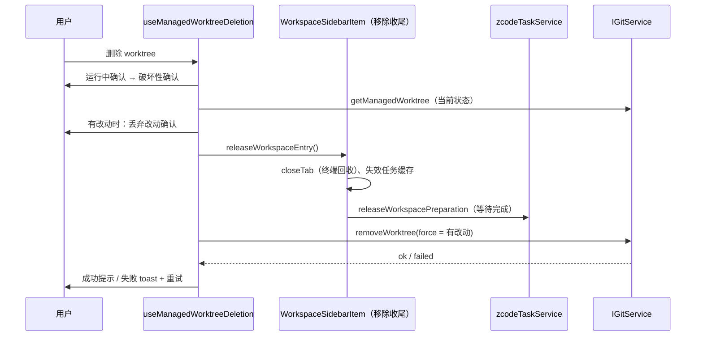
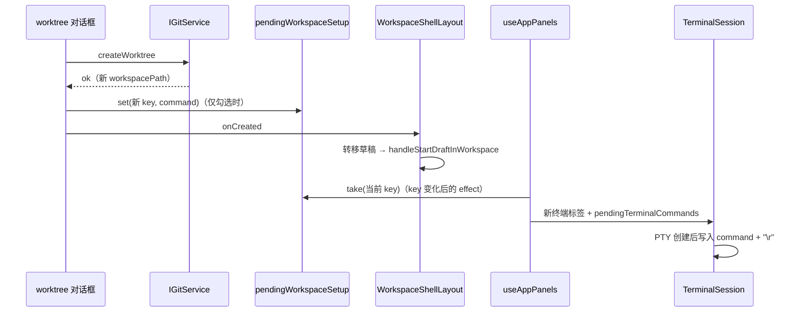

# 在新 Git worktree 中开始任务

> 英文版：[git-worktree-task.en.md](git-worktree-task.en.md)。本文件为规范来源，两者保持同步。

## 背景

Codex desktop 可以让任务在独立的 worktree 中运行，互不干扰当前检出。ZCode 只有“新建分支并切换”（在当前检出上
切换），没有创建 worktree 的入口；Agent 只能自己通过 bash 调用 `git worktree`。本规范复用既有的分支对话框、
workspace 打开与草稿转移，只新增一个 Git 服务方法。

## 接口与状态所有者

- worktree 的事实来源是 Git 本身；ZCode 不另存 worktree 列表。
- `IGitService.createWorktree({ workspacePath, branchName }): Promise<GitCreateWorktreeResult>`，
  由 `createGitService` → `GitCliRepo.createWorktree`（实现位于 `git/repo/gitWorktree.ts`）完成：
  - 成功：`{ ok: true, branchName, worktreePath, workspacePath }`；失败：`{ ok: false, branchName, issues }`，
    `issues` 复用 `GitBranchMutationIssue`（非法分支名、分支已存在、未知错误）。
- 新 workspace 只是一个新路径：身份 key 仍为 `workspaceIdentity?.trim() || workspacePath`，不新增协议字段。

## 服务规则

1. 仓库不可用时报错；分支名非法或已存在时返回对应 issue，不创建 worktree。worktree 从 HEAD 新建、不触碰当前检出，
   因此当前检出中的冲突或进行中的 merge/rebase 不构成阻塞。
2. worktree 根目录：`<ZCode 数据目录>/worktrees/<仓库目录名>-<仓库根路径 sha256 前 8 位>/<分支名 slug>`，
   slug 把 `[A-Za-z0-9._-]` 以外的字符替换为 `-`，Windows 保留设备名（首个 `.` 前为 `con`、`prn`、`aux`、`nul`、
   `com1`–`com9`、`lpt1`–`lpt9`，不区分大小写）在所有平台加 `wt-` 前缀；目录已存在时依次追加 `-2`、`-3`…（最多 99）。
   放在仓库外，避免出现在原仓库的文件树与 `git status` 中。
3. 先执行 `git worktree prune`（只清理目录已被删除的登记项，否则手动删除过的同名目录会让 add 失败），再执行
   `git worktree add -b <branch> <path> HEAD`：新分支从当前 HEAD 创建。**未提交的改动不会带入新 worktree**。
4. 若原 workspace 是仓库的子目录，返回的 `workspacePath` 为新 worktree 中对应的同一子目录；该子目录在 HEAD 中
   不存在（未跟踪、被忽略或新建）时回退为 worktree 根目录。
5. 失败时解析 git 输出为 issue；成功后使原 workspace 的缓存失效。

## 交互

- 仅本地 workspace 的草稿输入框分支切换器底部显示“在新 worktree 中开始…”（远程 workspace 需要远程身份构造，
  本期不提供）。
- 复用“新建分支”对话框（`mode="worktree"` 切换文案），说明新 worktree 基于当前提交、不包含未提交改动。
- 成功后：`requestV4ComposerDraftWorkspaceTransfer` 把当前草稿转移到新路径，再
  `handleStartDraftInWorkspace(新路径, undefined, "project")` 打开它并进入草稿；失败时对话框保持打开并以 toast
  显示第一条 issue。创建进行中不能关闭对话框；宿主组件卸载后返回的结果被忽略，不会再转移草稿或切换 workspace。
- 文案 `git.worktree.*`，`en-US` 与 `zh-CN` 同步提供。

## 删除 worktree

- 只允许删除 **ZCode 创建的** worktree：workspace 所在检出是链接 worktree（不是主检出），且其根目录位于
  `<ZCode 数据目录>/worktrees/` 下。用户自己创建的仓库或 worktree 不提供删除入口。
- `IGitService.getManagedWorktree({ workspacePath })`：满足上述条件时返回
  `{ worktreePath, mainWorktreePath, branchName, hasUncommittedChanges }`，否则 `null`（主检出与分支名取自
  `git worktree list --porcelain`；`hasUncommittedChanges` 为读取时 `git status` 是否有改动（含未跟踪文件），
  读取失败按有改动处理）。
- `IGitService.removeWorktree({ workspacePath, force? })`：
  - 不满足条件 → `{ ok: false, reason: "not-managed" }`；
  - 未指定 `force` 且有未提交改动 → `{ ok: false, reason: "dirty" }`，不删除；
  - 在主检出中执行 `git worktree remove [--force] <worktreePath>`；失败 → `{ ok: false, reason: "failed", detail }`；
  - 成功 → `{ ok: true, mainWorktreePath, branchName }`。**分支与其提交保留**，只删除目录与 worktree 登记。
- 交互：本地 workspace 的侧栏菜单在 `getManagedWorktree` 返回非空时显示“删除 worktree”（菜单打开时查询）。
  1. 若该 workspace 有运行中的对话，先沿用“移除”的运行中确认；
  2. 破坏性确认：说明将删除的目录、保留的分支；
  3. 重新调用 `getManagedWorktree` 读取当前状态；有未提交改动时再次确认“未提交的改动将永久丢失”，确认后以
     `force` 删除。**所有确认都在释放之前完成**，任何一步取消都不产生副作用。
  4. 执行与“移除”相同的收尾（关闭标签，终端随 workspace 关闭回收；释放运行时；失效任务缓存），并**等待运行时释放完成**；
  5. 再调用 `removeWorktree`。先释放后删除：Windows 上以该目录为 cwd 的 Agent/终端进程会占用目录，
     先删除会失败，甚至只删掉一部分文件。
  6. 成功提示分支已保留；失败时项目已从侧栏移除，toast 说明目录与分支均保留，并提供“重试”（再次调用
     `removeWorktree`，由用户触发，不做定时重试）。



- 文案 `workspaceSidebar.deleteWorktree` 与 `git.worktree.delete.*`，`en-US` 与 `zh-CN` 同步提供。

## 创建后的 setup 命令

- 配置：源 workspace 根目录 `.zcode/config.json` 的 `worktree.setup`（字符串）。规则与项目操作的 `command` 相同：
  首尾空白去掉后 1–4000 字符，不含控制字符或不可见格式字符（与项目操作相同的 `Cc`/`Cf`/`Zl`/`Zp` 规则，含换行与双向控制符）。由 `@zcode/shared` 的
  `parseWorktreeSetupConfig` 解析；与 `actions` 相互独立，一方无效不影响另一方。

  ```json
  { "worktree": { "setup": "pnpm install" } }
  ```

- 读取：对话框每次打开时读取一次源 workspace 的配置，与项目操作菜单共用同一读取函数（直接 `readTextFile`，
  最多 256 KB，文件不存在视为未配置，不缓存）。读取的是源 workspace 当前的文件，因此对话框里展示的就是将要执行
  的命令，即使新 worktree 检出的 HEAD 版本不同。
- 对话框：已配置时显示复选框“创建后运行 setup 命令”（默认勾选）与**完整**命令（等宽、自动换行、不截断）；
  配置无效、过大或无法读取时显示提示，不提供运行；未配置时不显示。创建进行中复选框禁用。
- 运行：创建成功且勾选时，在转移草稿与切换 workspace **之前**，把 `{ name: 本地化的“Setup”, command }` 登记到
  内存中的一次性表 `pendingWorkspaceSetup`（按新 workspace 的身份 key；本地 worktree 即其路径）。
  `useAppPanels` 在当前 workspace 身份 key 变化后取出（取出即删除），交给项目操作的 `handleRunProjectAction`：
  在新 workspace 的右侧面板新建终端标签（cwd 为新 workspace 路径），首条输入执行该命令。
  命令不进入标签状态，刷新或恢复不会重复执行。
- setup 命令的成败不影响 worktree 与草稿：输出留在终端，用户可以中断、重跑或关闭。



## 不在本期

- 在 worktree 与本地检出之间移交改动、远程 workspace。

## 验收

- `packages/services/test/gitWorktree.test.ts`（真实临时仓库）：删除只对 ZCode 创建的 worktree 生效、未提交改动需 `force`、
  删除后目录消失且分支保留；创建成功且检出新分支、子目录 workspace 映射、
  重名目录追加后缀、Windows 保留名加前缀、`hasUncommittedChanges` 反映未提交改动、已存在分支与非法分支名返回 issue 且不创建目录、未提交改动不带入。
- `packages/ui/test/projectActions.test.ts`：`worktree.setup` 解析（缺失、有效、非字符串、控制字符、与 `actions`
  互不影响）与 `pendingWorkspaceSetup` 一次性语义。
- Web 开发服务 + Playwright：在草稿分支菜单中选择“在新 worktree 中开始…”，输入分支名后打开新 workspace，
  草稿文本随之转移，`git worktree list` 显示新条目；配置 `worktree.setup` 时对话框显示完整命令，勾选创建后
  新 workspace 的右侧面板出现 Setup 终端并执行命令，取消勾选则不运行。
