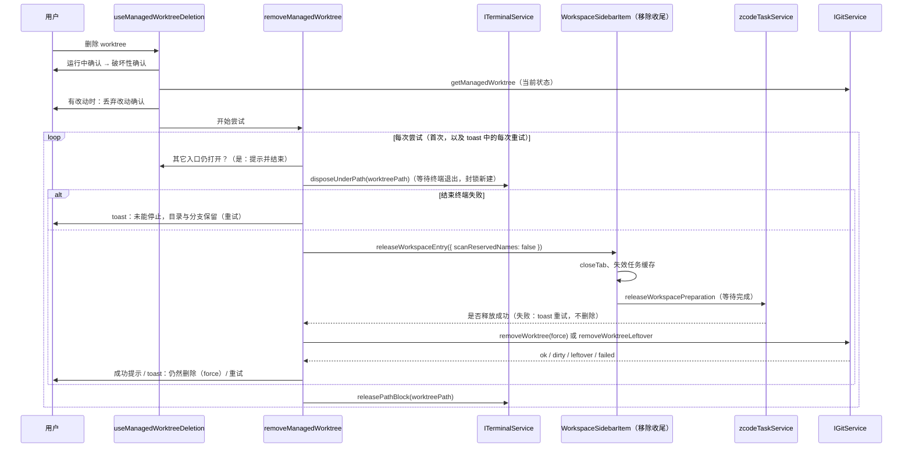
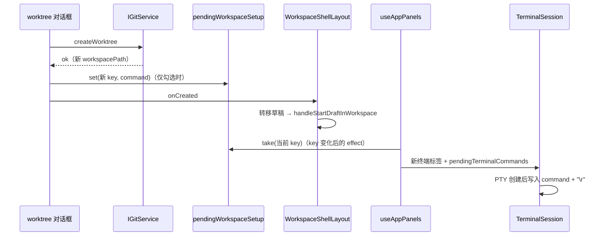

# 在新 Git worktree 中开始任务

> 英文版：[git-worktree-task.en.md](git-worktree-task.en.md)。本文件为规范来源，两者保持同步。

## 背景

Codex desktop 可以让任务在独立的 worktree 中运行，互不干扰当前检出。ZCode 只有“新建分支并切换”（在当前检出上
切换），没有创建 worktree 的入口；Agent 只能自己通过 bash 调用 `git worktree`。本规范复用既有的分支对话框、
workspace 打开与草稿转移，只新增一个 Git 服务方法。

## 接口与状态所有者

- worktree 的事实来源是 Git 本身；ZCode 不另存 worktree 列表。
- `IGitService.createWorktree({ workspacePath, branchName }): Promise<GitCreateWorktreeResult>`，
  由 `createGitService` → `GitCliRepo.createWorktree`（实现位于 `git/repo/gitWorktree.ts`）完成：
  - 成功：`{ ok: true, branchName, worktreePath, workspacePath }`；失败：`{ ok: false, branchName, issues }`，
    `issues` 复用 `GitBranchMutationIssue`（非法分支名、分支已存在、未知错误）。
- 新 workspace 只是一个新路径：身份 key 仍为 `workspaceIdentity?.trim() || workspacePath`，不新增协议字段。

## 服务规则

1. 仓库不可用时报错；分支名非法或已存在时返回对应 issue，不创建 worktree。worktree 从 HEAD 新建、不触碰当前检出，
   因此当前检出中的冲突或进行中的 merge/rebase 不构成阻塞。
2. worktree 根目录：`<ZCode 数据目录>/worktrees/<仓库目录名>-<仓库根路径 sha256 前 8 位>/<分支名 slug>`，
   slug 把 `[A-Za-z0-9._-]` 以外的字符替换为 `-`，Windows 保留设备名（首个 `.` 前为 `con`、`prn`、`aux`、`nul`、
   `com1`–`com9`、`lpt1`–`lpt9`，不区分大小写）在所有平台加 `wt-` 前缀；超过 80 个字符时截断并追加原分支名 sha256
   的前 8 位（常见文件系统单段上限为 255 字节，扁平化后的长分支名会超出）；目录已存在时依次追加 `-2`、`-3`…（最多 99）。
   放在仓库外，避免出现在原仓库的文件树与 `git status` 中。
3. 先执行 `git worktree prune`（只清理目录已被删除的登记项，否则手动删除过的同名目录会让 add 失败），再执行
   `git worktree add -b <branch> <path> HEAD`：新分支从当前 HEAD 创建。**未提交的改动不会带入新 worktree**。
4. 若原 workspace 是仓库的子目录，返回的 `workspacePath` 为新 worktree 中对应的同一子目录；该子目录在 HEAD 中
   不存在（未跟踪、被忽略或新建）时回退为 worktree 根目录。
5. 失败时解析 git 输出为 issue；成功后使原 workspace 的缓存失效。

## 交互

- 仅本地 workspace 的草稿输入框分支切换器底部显示“在新 worktree 中开始…”（远程 workspace 需要远程身份构造，
  本期不提供）。
- 复用“新建分支”对话框（`mode="worktree"` 切换文案），说明新 worktree 基于当前提交、不包含未提交改动。
- 成功后：`requestV4ComposerDraftWorkspaceTransfer` 把当前草稿转移到新路径，再
  `handleStartDraftInWorkspace(新路径, undefined, "project")` 打开它并进入草稿；失败时对话框保持打开并以 toast
  显示第一条 issue。创建进行中不能关闭对话框；宿主组件卸载后返回的结果被忽略，不会再转移草稿或切换 workspace。
- 文案 `git.worktree.*`，`en-US` 与 `zh-CN` 同步提供。

## 删除 worktree

- 只允许删除 **ZCode 创建的** worktree：workspace 所在检出是链接 worktree（不是主检出），其根目录位于
  `<ZCode 数据目录>/worktrees/` 下，**且带有 ZCode 创建标记**。用户自己创建的仓库或 worktree（包括手动放进该目录的）
  不提供删除入口。
  - 创建标记：`createWorktree` 成功后在该 worktree 自己的 Git 管理目录（`git rev-parse --absolute-git-dir`，即
    `<common-dir>/worktrees/<name>`）写入 `zcode-worktree.json`（`{ createdBy: "zcode", worktreePath }`）。
    该目录不属于仓库内容，克隆或检出无法伪造；`git worktree remove`/`prune` 时随之删除。写入失败时 worktree 仍可用，
    只是不提供删除入口。读取时要求标记存在、`createdBy` 为 `zcode` 且 `worktreePath` 的真实路径与当前检出一致。
- `IGitService.getManagedWorktree({ workspacePath })`：满足上述条件时返回
  `{ worktreePath, mainWorktreePath, branchName, hasUncommittedChanges }`，否则 `null`（主检出与分支名取自
  `git worktree list --porcelain`；`hasUncommittedChanges` 为读取时 `git status` 是否有改动（含未跟踪文件），
  读取失败按有改动处理）。
- `IGitService.removeWorktree({ workspacePath, force? })`：
  - 不满足条件 → `{ ok: false, reason: "not-managed" }`；
  - 未指定 `force` 且有未提交改动 → `{ ok: false, reason: "dirty" }`，不删除；
  - 在主检出中执行 `git worktree remove [--force] <worktreePath>`；失败时再查登记：仍登记 →
    `{ ok: false, reason: "failed", detail }`；登记已消失（目录删除中途失败时 git 可能已删掉管理目录，常见于 Windows
    目录占用）→ `{ ok: false, reason: "leftover", detail }`；
  - 成功 → `{ ok: true, mainWorktreePath, branchName }`。**分支与其提交保留**，只删除目录与 worktree 登记。
- `IGitService.removeWorktreeLeftover({ worktreePath })`：清理 `leftover` 剩下的目录。只允许删除
  `<ZCode 数据目录>/worktrees/<仓库目录>/<worktree 目录>` 这一层、且已不是有效 Git 检出（没有 `.git`，或 `.git` 文件
  指向的管理目录已不存在）的目录，否则返回 `not-leftover`；目录已不存在视为成功。
- `ITerminalService.disposeUnderPath({ path })`：结束所有初始 cwd 位于该目录（含自身）下的终端，并在进程退出后 resolve
  （等待上限 5 秒，只防止删除流程无限挂起）。仍在 `create()` 中的终端在第一个 await 前即登记：被标记取消后，
  启动即结束并以错误返回，`disposeUnderPath` 同样等待它结束。`disposeUnderPath` 还会（在任何 await 之前）封锁该目录：
  此后请求、解析或真实 cwd（经符号链接到达同一目录也算）位于其下的新 `create()` 被拒绝，直到调用
  `ITerminalService.releasePathBlock({ path })`；删除流程在删除尝试结束（成功或失败）后解除封锁。封锁记录该目录的
  设备号、inode 与创建时间：界面重载或崩溃导致未解除时，一旦该目录已不存在或已是同路径上新建的另一个目录，封锁即失效，
  不会让之后的 worktree 无法开终端（不依赖定时器）。已知限制：若解除封锁的请求本身丢失（如连接中断）而目录保留，
  封锁持续到下一次删除成功删掉该目录或 Host 退出。被拒绝的 `create()` 的错误信息不含路径（终端界面会按 error 级别记录）。终端服务是所有 PTY 的唯一所有者，覆盖右侧面板与底部终端。
- 前提：若同一 worktree 还以其它本地入口打开（如根目录与某个子目录），拒绝删除并提示先关闭这些入口（确认前、释放前
  以及 toast 中每次重试前各检查一次；路径字符串不匹配时由本地 Host 解析两边的真实路径（`IFileService.resolvePath`，
  worktree 路径只解析一次）再比较，覆盖经符号链接或 junction 打开的入口，包括指向 worktree 内子目录的别名；仍不匹配时
  （如 bind mount 这类 realpath 识别不了的别名，或解析失败）再按该入口所在的 worktree（`getManagedWorktree`）比较）；否则其它入口的
  Agent 仍在 worktree 内运行，删除会失败或删掉未确认的活动检出。
- 交互：本地 workspace 的侧栏菜单在 `getManagedWorktree` 返回非空时显示“删除 worktree”（菜单打开时查询）。
  1. 若该 workspace 有运行中的对话，先沿用“移除”的运行中确认；
  2. 破坏性确认：说明将删除的目录、保留的分支；
  3. 重新调用 `getManagedWorktree` 读取当前状态；有未提交改动时再次确认“未提交的改动将永久丢失”，确认后以
     `force` 删除。**所有确认都在释放之前完成**，任何一步取消都不产生副作用。
     确认之后的步骤由 `packages/ui/src/lib/worktreeRemoval.ts` 的 `removeManagedWorktree` 执行（不依赖 React，
     侧栏行关闭入口后即卸载）。**每次尝试都完整执行 4–6**，包括 toast 中的每次重试：先检查其它入口，再结束终端、
     释放 runtime、删除、解除封锁。这些调用都可重复（关闭已关闭的入口为空操作，没有运行中的 runtime 时释放为空操作）。
     这样重试时即使用户在此期间重新打开过该 worktree、开了终端又“移除”（“移除”不等待终端与 runtime 退出），也会先结束
     它们再删除。
  4. 调用 `disposeUnderPath(worktreePath)` 并**等待终端退出**；再执行与“移除”相同的收尾（关闭标签；释放运行时；
     失效任务缓存），并**等待运行时释放完成**。删除流程不做 Windows 保留名扫描（目录即将删除，扫描还会在删除时占用目录）。
     结束终端的请求失败或运行时释放失败（`releaseWorkspacePreparation` 拒绝，如 IPC 或 Host 中断）时**不删除**：
     提示未能停止任务和终端、目录与分支均已保留，并提供“重试”。结束终端失败时不关闭入口（首次尝试时侧栏行仍在）。
     普通“移除”不关心释放结果。
  5. 再调用 `removeWorktree`（清理剩余目录的重试调用 `removeWorktreeLeftover`）。先释放后删除：Windows 上以该目录为
     cwd 的 Agent/终端进程会占用目录，先删除会失败，甚至只删掉一部分文件。
  6. 结果（除结束终端失败外，侧栏行此时已卸载；后续确认与重试都通过 toast 操作完成，由用户触发，不做定时重试）：
     - 成功：提示分支已保留；
     - `dirty`（确认之后又出现了改动，用户没有同意丢弃）：提示未删除，提供“仍然删除”（以 `force` 重新尝试）；
     - `leftover`：提示目录未能完全删除、分支已保留，“重试”的删除步骤改为 `removeWorktreeLeftover`；
     - 其它失败（git 未删除任何内容，如 worktree 被锁定）：提示目录与分支都已保留，“重试”重新尝试 `removeWorktree`。
  - 日志只记录失败类别，不记录 git 的错误信息（其中含路径）；完整信息只在提示中展示。



- 文案 `workspaceSidebar.deleteWorktree` 与 `git.worktree.delete.*`，`en-US` 与 `zh-CN` 同步提供。

## 创建后的 setup 命令

- 配置：源 workspace 根目录 `.zcode/config.json` 的 `worktree.setup`（字符串）。规则与项目操作的 `command` 相同：
  首尾空白去掉后 1–4000 字符，不含控制字符或不可见字符（与项目操作 `command` 相同的规则，含换行、双向控制符、默认不可见字符与超长连续空白）。由 `@zcode/shared` 的
  `parseWorktreeSetupConfig` 解析；与 `actions` 相互独立，一方无效不影响另一方。

  ```json
  { "worktree": { "setup": "pnpm install" } }
  ```

- 读取：对话框每次打开时读取一次源 workspace 的配置，与项目操作菜单共用同一读取函数（直接 `readTextFile`，
  最多 256 KB，文件不存在视为未配置，不缓存）。读取的是源 workspace 当前的文件，因此对话框里展示的就是将要执行
  的命令，即使新 worktree 检出的 HEAD 版本不同。
- 对话框：已配置时显示复选框“创建后运行 setup 命令”（默认勾选）与**完整**命令（等宽、自动换行、不截断）；
  配置无效、过大或无法读取时显示提示，不提供运行；未配置时不显示。创建进行中复选框禁用。
- 运行：创建成功且勾选时，在转移草稿与切换 workspace **之前**，把 `{ name: 本地化的“Setup”, command }` 登记到
  内存中的一次性表 `pendingWorkspaceSetup`（按新 workspace 的身份 key；本地 worktree 即其路径）。
  `useAppPanels` 在当前 workspace 身份 key 变化后取出（取出即删除），交给项目操作的 `handleRunProjectAction`：
  在新 workspace 的右侧面板新建终端标签（cwd 为新 workspace 路径），首条输入执行该命令。
  命令不进入标签状态，刷新或恢复不会重复执行。
- 草稿转正：Setup 终端在草稿态打开（归属草稿）。v4 会话创建（`onSessionCreated`）时，若当前处于草稿，先把该 workspace
  中归属草稿的 tab 交给新会话（`adoptDraftSidePaneTabs`），再切到新会话，因此发出首条消息后 Setup 终端仍然可见。
- setup 命令的成败不影响 worktree 与草稿：输出留在终端，用户可以中断、重跑或关闭。



## 不在本期

- 在 worktree 与本地检出之间移交改动、远程 workspace。

## 验收

- `packages/services/test/gitWorktree.test.ts`（真实临时仓库）：删除只对 ZCode 创建的 worktree 生效、未提交改动需 `force`、
  删除后目录消失且分支保留；创建成功且检出新分支、子目录 workspace 映射、
  重名目录追加后缀、Windows 保留名加前缀、`hasUncommittedChanges` 反映未提交改动、已存在分支与非法分支名返回 issue 且不创建目录、未提交改动不带入；
  手动放进 worktrees 目录的 worktree（无创建标记）不可删除；删除中途失败且登记消失时返回 `leftover`，
  `removeWorktreeLeftover` 只清理第二层的失效检出。
- `packages/services/test/terminalDisposeUnderPath.test.ts`：按目录匹配终端（含子目录，不含同名前缀的兄弟目录）。
- `packages/ui/test/sidePaneDraftAdoption.test.ts`：草稿态 tab 转正后归属新会话，其它会话与其它 workspace 不受影响。
- `packages/ui/test/projectActions.test.ts`：`worktree.setup` 解析（缺失、有效、非字符串、控制字符、与 `actions`
  互不影响）与 `pendingWorkspaceSetup` 一次性语义。
- Web 开发服务 + Playwright：在草稿分支菜单中选择“在新 worktree 中开始…”，输入分支名后打开新 workspace，
  草稿文本随之转移，`git worktree list` 显示新条目；配置 `worktree.setup` 时对话框显示完整命令，勾选创建后
  新 workspace 的右侧面板出现 Setup 终端并执行命令，取消勾选则不运行；发出首条消息后 Setup 终端仍然可见。
  删除时以该 worktree 为 cwd 的进程在删除前全部退出；用 `chattr +i` 锁定其中一个文件模拟删除中途失败：
  toast 提示未完全删除，解锁后“重试”删除剩余目录，分支保留。
